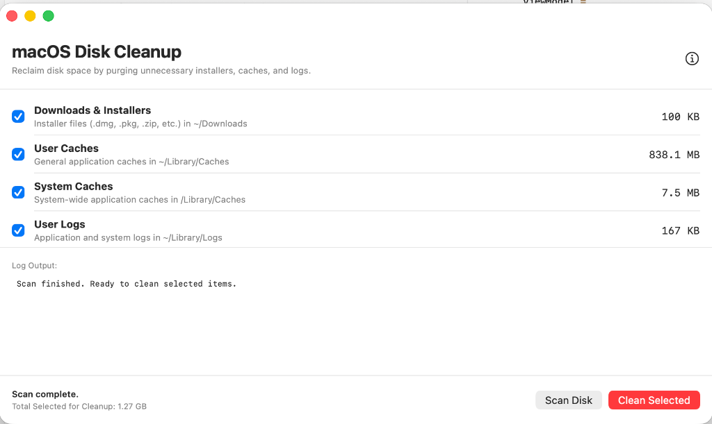

# macOS Disk Cleanup Utility & GUI App

A native macOS application and command-line utility to scan, estimate, and safely clean up temporary files, installer archives, application logs, and developer caches on macOS.



## Features

- **Native macOS GUI App**: Built with SwiftUI, offering a clean user interface with checkboxes, real-time logging, and dynamic space calculation.
- **Lightweight & Dependency-free**: Written in native Swift (App) and Python (CLI) with no heavy external framework dependencies.
- **Safe Scan (Dry-Run)**: Analyzes disk space and prints path details/sizes before performing any deletion.
- **Categorized Purging**: Selectively clear categories such as package manager caches, user logs, Xcode derived data, or temporary directories.
- **macOS Permissions Aware**: Gracefully logs and skips protected directories (e.g., SIP/TCC restricted system caches) instead of crashing.

---

## Monitored Categories

| Category ID | Category Name | Key Paths Scanned | File Types / Purpose |
| :--- | :--- | :--- | :--- |
| `downloads_installers` | **Downloads & Installers** | `~/Downloads` | `.dmg`, `.pkg`, `.zip`, `.tar.gz`, `.tgz`, `.app` files |
| `user_caches` | **User Caches** | `~/Library/Caches` | General application cache files |
| `package_manager_caches` | **Package Manager Caches**| Homebrew, pip, npm, cargo caches | Downloaded package archives and registries |
| `user_logs` | **User Logs** | `~/Library/Logs` | Application logs and diagnostics |
| `xcode_derived_data` | **Xcode Derived Data** | `~/Library/Developer/Xcode/DerivedData` | Build artifacts and project index cache |
| `system_caches` | **System Caches** | `/Library/Caches` | System-wide cache directories |
| `system_tmp` | **System Temp** | `/tmp` (or `/private/tmp`) | Temporary files |

---

## Getting Started: SwiftUI App

### How to Run the App
To open the compiled native application bundle:
```bash
open Cleanup.app
```
*(Or locate `Cleanup.app` in Finder and double-click to open it).*

### How to Build the App from Source
If you make changes to `CleanupApp.swift`, you can recompile and bundle the app using the provided script:
```bash
./build.sh
```

---

## Command Line Interface (Python)

### 1. Scan (Dry Run / Inspect Space)
Run the script with the `scan` argument to analyze files and output a size breakdown:
```bash
python3 cleanup.py scan
```

### 2. Clean Specific Category
Run the script with `clean` followed by the category identifier to delete files/folders under that category:
```bash
python3 cleanup.py clean <category_id>
```
*Example (cleaning package manager caches):*
```bash
python3 cleanup.py clean package_manager_caches
```

## Security & Safety

- The utility **does not delete directories recursively** unless they explicitly match an installer directory format (e.g. `.app` inside Downloads) or are contents within cache/temp directories.
- Always review the scan results before executing any deletion commands.
